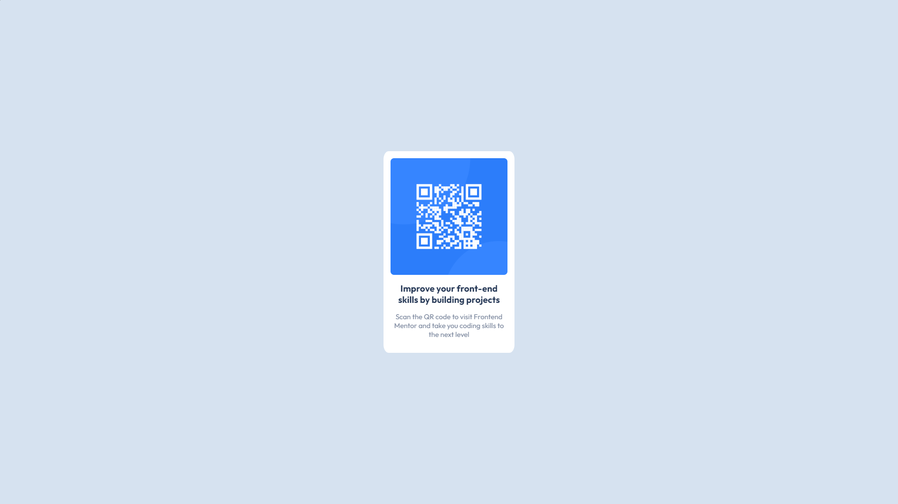

# Manuel Navarro - QR code component

Esta es una solución al [desafío del componente de código QR de Frontend Mentor](https://www.frontendmentor.io/challenges/qr-code-component-iux_sIO_H).

## Screenshot

## Stack Tecnológico

- HTML5
- CSS
- Flexbox

## Autor

- Website - [manuelnavarrodev.es](https://manuelnavarrodev.es/)
- Linkedln - [Manuel Navarro Higueras](https://www.linkedin.com/in/manuel-navarro-higueras/)
- Twitter - [@ManuNH98](https://www.twitter.com/ManuNH98)
